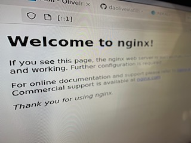
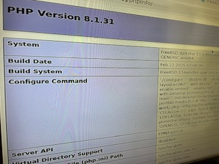

<!-- ABOUT THE PROJECT -->

# Automatic Configuration Server

_Utiliza comunica&ccedil;&atilde;o bidirecional com o uso de envelopes SOAP (Simple Object Access Protocol) que carregam estrutura XML (Extensive Markup Language). A api realiza a leitura e a configura&ccedil;&atilde;o dos par&acirc;metros das CPEs._

# Pr&eacute;-requisitos do sistema

### Plataformas compat&iacute;veis

* FreeBSD 11.1 ou posterior
* GNU/Linux portando o kernel 5 ou posterior

### Requisitos de hardware

* 1-8 n&uacute;cleo(s) de CPU
* 1-16Gb de mem&oacute;ria RAM
* 128Gb de storage

### Nginx

O Nginx &eacute; um servidor web que pode funcionar como um proxy reverso, encaminhando solicita&ccedil;&otilde;es de clientes para o PHP-FPM e retornando as respostas processadas de volta para os clientes.

```sh
server {
#listen 80;
listen [::1]:80;
server_name dominio.exemplo.br computador.dominio.exemplo.br;
error_page 500 502 503 504 /50x.html;
location = /50x.html {
root /usr/local/www;
}
error_page 404 402 403 404 /40x.html;
location = /40x.html {
root /usr/local/www;
}
location / {
root /usr/local/www;
index index.html;
}
...
```



### PHP-FPM

O “PHP FastCGI Process Manager,” &eacute; um gerenciador de processos FastCGI avan&ccedil;ado e de alto desempenho para PHP.

```sh
[www]
user = www
group = www
listen = [::1]:9900
listen.owner = www
listen.group = www
listen.mode = 0440
...
```



```sh
location ^~ /phpPgAdmin {
alias /usr/local/www/phpPgAdmin;
index index.php;
location ~ \.php$ {
root /usr/local/www;
include fastcgi_params;
fastcgi_param SCRIPT_FILENAME $document_root$fastcgi_script_name;
fastcgi_pass [::1]:9900;
} }
```

# Solu&ccedil;&atilde;o para gerenciamento de acesso privilegiado em ambientes h&iacute;bridos.

_Monitorar, detectar e previnir atividades maliciosas relacionadas ao abuso de privil&eacute;gios, com o objetivo de reduzir a superf&iacute;cie de ataque._

## Uso


### PHPPgAdmin

O phpPgAdmin &eacute; uma ferramenta de gerenciamento para Postgres, o pacote deve ser descompactado no diret&oacute;rio referente ao alias configurado em nginx.conf.

```sh
drwxr-xr-x 12 www www /usr/local/www/phpPgAdmin
```


