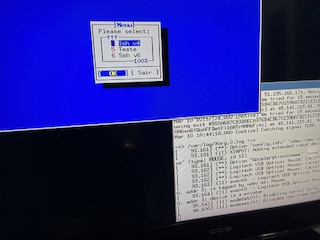
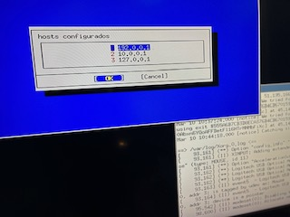
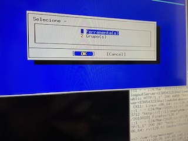
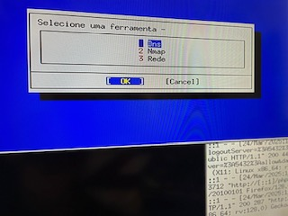
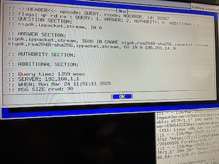
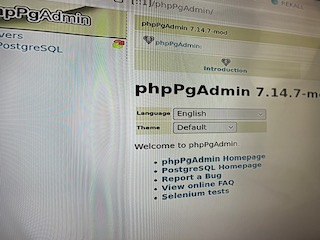
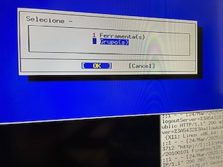
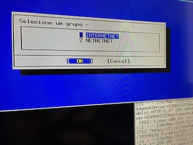
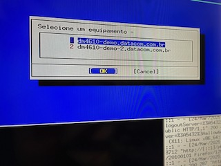
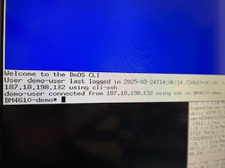

<!-- ABOUT THE PROJECT -->

# Solu&ccedil;&atilde;o para gerenciamento de acesso privilegiado em ambientes h&iacute;bridos

### Funcionalidades de identifica&ccedil;&atilde;o de falhas, provisionamento, configura&ccedil;&atilde;o, invent&aacute;rio, performance e seguran&ccedil;a.

### Permite integra&ccedil;&atilde;o com outras plataformas.

_Monitorar, detectar e previnir atividades maliciosas relacionadas ao abuso de privil&eacute;gios, com o objetivo de reduzir a superf&iacute;cie de ataque._











## Protegendo o acesso ao pr&oacute;prio PAM

### PHPPgAdmin

O phpPgAdmin &eacute; uma ferramenta de gerenciamento para Postgres, o pacote deve ser descompactado no diret&oacute;rio referente ao alias configurado em nginx.conf.

```sh
drwxr-xr-x 12 www www /usr/local/www/phpPgAdmin
```



### Contas de servi&ccedil;o e administradores sombra n&atilde;o detectados








