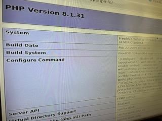
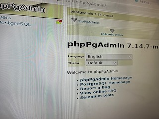
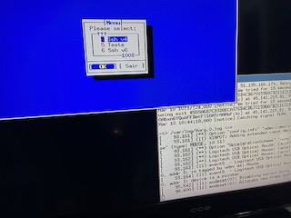

<!-- ABOUT THE PROJECT -->

# O _???Tool_ &eacute; uma solu&ccedil;&atilde;o de gerenciamento de acesso privilegiado para ambientes h&iacute;bridos.

_PAM &eacute; um subcampo da Ger&ecirc;ncia de Identidade e Acesso (IAM)._

_Monitorar, detectar e previnir atividades maliciosas relacionadas ao abuso de privil&eacute;gios, reduzir a superf&iacute;cie de ataque, prevenir e mitigar danos causados por ataques externos e amea&ccedil;as internas._

### Pr&eacute;-requisitos

Os requisitos m&iacute;nimos para rodar o _???Tool_ s&atilde;o:
* 1 n&uacute;cleo de CPU.
* 2Gb de mem&oacute;ria RAM
* 10Gb de storage

### Configura&ccedil;&atilde;o do Nginx.

```sh
vi /usr/local/etc/nginx/nginx.conf
```

```sh
server {
#listen 80;
listen [::1]:80;
server_name	rekall.log darkstar.rekall.log;
error_page 500 502 503 504 /50x.html;
location = /50x.html {
root /usr/local/www;
}
error_page  404 /40x.html;
location = /40x.html {
root /usr/local/www;
}
location / {
root /usr/local/www;
index	index.html;
}
...
```


### Configura&ccedil;&atilde;o do php-fpm.

```sh
vi /usr/local/etc/php-fpm.d/www.conf
```

```sh
[www]
user = www
group = www
listen = [::1]:9000
listen.owner = www
listen.group = www
listen.mode = 0440
...
```

Optamos por adicionar uma aplica&ccedil;&atilde;o isolada, configurando o nginx.conf.

```sh
location ^~ /phpPgAdmin {
alias	/usr/local/www/phpPgAdmin;
index	index.php;
location ~ \.php$ {
root	/usr/local/www;
include        fastcgi_params;
fastcgi_param  SCRIPT_FILENAME	$document_root$fastcgi_script_name;
fastcgi_pass   [::1]:9000;
} }
```



### Configura&ccedil;&atilde;o do phpPgAdmin.

O phpPgAdmin deve ser descompactado no diret&oacute;rio /usr/local/www/phpPgAdmin/



### Instala&ccedil;&atilde;o do Postgresql e suas depend&ecirc;ncias.

```sh
groupadd -g 209 postgres
```
```sh
useradd -u 209 -g 209 -d /var/lib/pgsql postgres
```
```sh
bash /postgresql17.SlackBuild
```

<!-- DOCUMENTA&Ccedil;&Atilde;O -->
## Uso




